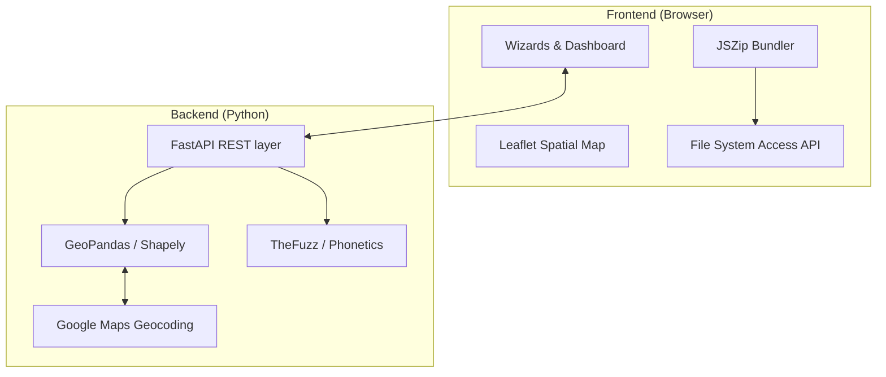
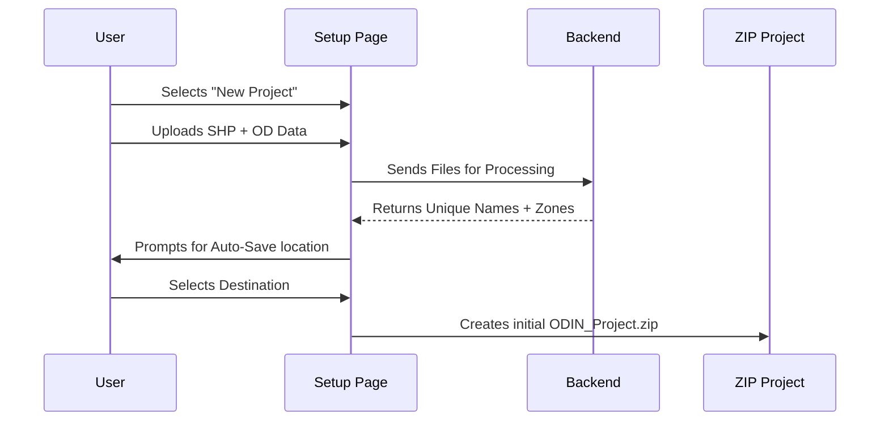

# ODIN: Origin-Destination Intelligent Navigator

## Product Overview
**ODIN** is a professional-grade geospatial validation and analytical platform designed to automate the complex process of Origin-Destination (OD) data coding. By combining advanced spatial intelligence with phonetic matching algorithms, ODIN transforms raw, manually-surveyed place names into validated, geocoded, and zone-mapped datasets ready for transport planning and economic modeling.

---

## Technical Architecture

### Core Stack
- **Frontend**: Single Page Application (SPA) built with Vanilla JavaScript, **Leaflet.js** for spatial visualization, and **JSZip** for client-side project bundling.
- **Backend**: **FastAPI** (Python) high-performance REST API, leveraging **GeoPandas** and **Shapely** for computational geometry.
- **Data Persistence**: A transparent, ZIP-based project model utilizing the browser's **File System Access API** for real-time background auto-saving.

### System Diagram


---

## Operational Modes

| Mode | Objective | key Metric |
| :--- | :--- | :--- |
| **Zone Assign** | Macro-classification of survey locations into administrative or traffic zones. | Point-in-Polygon (PIP) accuracy. |
| **Place Assign** | High-precision coordinate resolution within pre-defined zone boundaries. | Euclidean distance from survey centroid. |
| **Base Number** | Deep-dive traffic analytics and revenue insights using historical IHMCL datasets. | AADT, MADT, and SCF calculations. |

---

## Key Technical Features

### 1. Spatial Intelligence Engine
ODIN automatically extracts **District** and **State** boundaries from uploaded Shapefiles. When a user resolves a place name, the system performs an automated Point-in-Polygon lookup to verify administrative alignment, ensuring no data exits its intended spatial bounds.

### 2. Transparent Auto-Save
Utilizing the modern **File System Access API**, ODIN establishes a silent, background synchronization stream. 
- **Debounced Save**: Changes are buffered and saved every 1 second of inactivity to ensure a lag-free experience.
- **ZIP Bundling**: The entire project (OD data, Shapefile, and Resolutions) is packed into a single `.zip` file for total portability.

### 3. Progressive Resolution Workflow
The "Select and Resolve" interface allows users to apply a resolution to multiple survey locations simultaneously. This is particularly effective for high-frequency places recorded across different plazas, reducing manual effort by up to 80%.

---

## Technical Flowcharts

### Project Initialization Flow


### Resolution Logic (Zone/Place Assign)
```mermaid
+flowchart TD
+    A[Raw Survey Name] --> B[Double Metaphone Phonetic Search]
+    B --> C[Local Reference Candidates]
+    C --> D[Fuzzy Similarity Scoring (thefuzz)]
+    D --> E[Top N Internal Matches]
+    E --> F[Google Geocoding (Fetch Lat/Lng per Match)]
+    F --> G[Zone Boundary & Proximity Re-ranking]
+    G --> H[Final Candidate Suggestions]
```

### Data Export Hierarchy
ODIN results are exported into a multi-sheet formatted Excel workbook:
1. **Resolved_Places**: Mapping of Unique Names to Lat/Lng, District, State, and Zone.
2. **Auto_OD_input**: The original dataset updated with `Origin_code` and `Destination_code`.
3. **Plaza_Coordinates**: Verified locations of all survey plazas.

---

> [!NOTE]
> ODIN is designed for offline-first reliability. While Google Maps integration exists for advanced geocoding, core spatial lookups against local Shapefiles are performed locally on the server to ensure high performance with large datasets.
